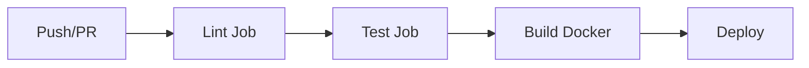

# xScanner

**AI-powered OCR and Vision API for extracting structured data from bullion bar images**

Extract serial numbers, metal type, weight, fineness, and producer information from gold, silver, platinum, and palladium bar images using state-of-the-art OCR and Vision LLM technologies.

## 🎯 Overview

This project provides a REST API and CLI tools for automated extraction of metadata from precious metal bar images. It combines traditional OCR (PaddleOCR) with modern Vision Language Models (LLMs) to achieve high accuracy even on difficult-to-read serial numbers and text.

### Key Features

- 🤖 **Multiple OCR Strategies**: PaddleOCR, ChatGPT Vision, Gemini Flash, Hybrid approaches
- 🚀 **REST API**: FastAPI-based service with async support
- 📊 **Performance Benchmarking**: Compare strategies with visual reports
- 🐳 **Docker Support**: Containerized deployment ready
- 🔄 **CI/CD Pipeline**: Automated testing and Docker builds
- 📝 **OpenAPI/Swagger**: Interactive API documentation

---

## 🏗️ Architecture

### Technology Choices

**Why Python?**
- Rich ecosystem for ML/OCR libraries (PaddleOCR, OpenCV, Pillow)
- Excellent API frameworks (FastAPI)
- Native support for AI/ML APIs (OpenAI, Google Gemini)

**Why No Persistence?**
- Stateless design for horizontal scalability
- Images processed on-demand, results returned immediately
- Optional integration with external systems (e.g., aXedras Bullion Integrity Ledger)

**Why Ollama/Llama Vision?**
- **Privacy**: Local inference, no data leaves your infrastructure
- **Cost**: No per-request API charges
- **Speed**: On GPU hardware, competitive with cloud APIs
- **Accuracy**: Llama 3.2 Vision 11B delivers excellent results on structured extraction

### OCR Strategy Insights

| Strategy | Accuracy | Speed | Notes |
|----------|----------|-------|-------|
| **ChatGPT Vision (gpt-4o-mini)** | ⭐⭐⭐⭐⭐ | ⚡⚡⚡ | Best overall, fast, requires API key |
| **Gemini Flash 2.0** | ⭐⭐⭐⭐⭐ | ⚡⚡⚡⚡ | Fastest, excellent accuracy, requires API key |
| **Hybrid (PaddleOCR + Llama 11B)** | ⭐⭐⭐⭐⭐ | ⚡ | Best for privacy, CPU slow (5min/image), GPU fast (15-30s/image) |
| **PaddleOCR alone** | ⭐⭐⭐ | ⚡⚡⚡ | Good for serial numbers, struggles with fineness |

**Key Insight**: Llama Vision has difficulty detecting small serial numbers on bars, while PaddleOCR excels at this. The **Hybrid strategy** combines both: PaddleOCR extracts the serial number, Llama Vision handles the rest.

**Not Tested**: Azure Computer Vision, AWS Rekognition Custom Labels (could be evaluated in future)

**Deprecated Strategies** (removed for poor performance):
- Tesseract OCR - lowest accuracy
- EasyOCR - unreliable timeouts
- Regex/NLP - insufficient standalone accuracy
- YOLOv8 - not suitable for this use case

---

## 🚀 Quick Start

### Prerequisites

- Python 3.11+
- (Optional) Ollama for local LLM inference
- (Optional) Docker for containerized deployment

### Installation

```bash
# Clone repository
git clone https://github.com/aXedras/xScanner.git
cd xScanner

# Install dependencies
pip install -e ".[dev]"  # Core OCR + REST API + Development tools

# Configure API keys (optional, for cloud strategies)
cp .env.example .env
# Edit .env with your OpenAI/Google API keys
```

### Running the REST API Server

```bash
# Start the FastAPI server
python -m src.server

# Or with uvicorn directly
uvicorn src.server:app --host 0.0.0.0 --port 8000 --reload
```

Server runs at: `http://localhost:8000`

**API Documentation:**
- Swagger UI: `http://localhost:8000/docs`
- ReDoc: `http://localhost:8000/redoc`
- OpenAPI JSON: `http://localhost:8000/openapi.json`

### Using the API

**Upload Image (Multipart):**
```bash
curl -X POST "http://localhost:8000/extract/upload" \
  -F "file=@path/to/bullion_bar.jpg" \
  -F "strategy=cloud"
```

**Base64 Image:**
```bash
curl -X POST "http://localhost:8000/extract" \
  -H "Content-Type: application/json" \
  -d '{
    "image_base64": "...",
    "strategy": "local",
    "register_on_bil": false
  }'
```

**Response:**
```json
{
  "success": true,
  "request_id": "uuid",
  "structured_data": {
    "SerialNumber": "715562",
    "Metal": "Gold",
    "Weight": "100",
    "WeightUnit": "g",
    "Fineness": "999.9",
    "Producer": "Argor Heraeus"
  },
  "confidence": 0.95,
  "processing_time": 5.2,
  "strategy_used": "ChatGPT Vision (gpt-4o-mini)"
}
```

---

## 📊 Benchmarking & Reports

### Run OCR Strategy Comparison

```bash
# Test on first 10 images
MAX_TEST_IMAGES=10 python test_ocr_strategies.py

# Test on half of available images (default)
python test_ocr_strategies.py

# Test on all images
MAX_TEST_IMAGES=86 python test_ocr_strategies.py
```

Results saved to: `ocr_comparison_results.json`

### Generate Visual Report

```bash
python scripts/generate_report.py
```

Report created at: `reports/ocr_report.html`

**View Report:**
- Open in browser: `file:///.../reports/ocr_report.html`
- Or via API: `http://localhost:8000/report` (when server running)

**Report Features:**
- Performance summary: Accuracy vs. Speed comparison
- Per-image results with confidence scores
- Ground truth validation (for filenames with metadata)
- Strategy leaderboard

---

## 🛠️ CLI Tools

### Main Executables

| Script | Purpose | Usage |
|--------|---------|-------|
| **`test_ocr_strategies.py`** | Benchmark all OCR strategies | `python test_ocr_strategies.py` |
| **`src/server.py`** | REST API server | `python -m src.server` |
| **`scripts/generate_report.py`** | Generate HTML comparison report | `python scripts/generate_report.py` |
| **`chatgpt_image_extractor.py`** | Standalone ChatGPT Vision extraction | `python chatgpt_image_extractor.py <image>` |
| **`callerAxedras.py`** | Integration with aXedras BIL | `python callerAxedras.py` |

### Deprecated/Legacy Scripts

- ~~`chatgpt_extractor.py`~~ - Text-only extraction (superseded by Vision)
- ~~`invoiceExtractor.py`~~ - Similar to chatgpt_image_extractor (redundant)
- ~~`ocr_comparator.py`~~ - Now imported as module by test_ocr_strategies.py

---

## 🔧 Development

### Pre-commit Hooks

We use pre-commit hooks to maintain code quality:

```bash
# Install hooks
pre-commit install

# Run manually
pre-commit run --all-files
```

**Hooks Enabled:**
- **trailing-whitespace**: Remove trailing whitespace
- **end-of-file-fixer**: Ensure files end with newline
- **check-yaml/json**: Validate config files
- **detect-private-key**: Prevent committing secrets
- **ruff**: Fast Python linter (replaces flake8, pylint)
- **ruff-format**: Python formatter (replaces Black)
- **mypy**: Static type checking

**Why these hooks?**
- Enforce consistent code style across team
- Catch errors before CI/CD
- Prevent security issues (leaked keys)
- Improve code quality and maintainability

### CI/CD Pipeline

**GitHub Actions** (`.github/workflows/ci.yml`):



**Jobs:**
1. **Lint**: Ruff linter, Ruff formatter, Mypy type checking
2. **Test**: Pytest with coverage
3. **Build**: Docker image → GitHub Container Registry (`ghcr.io`)
4. **Deploy**: Triggered on releases (notification placeholder)

**Triggers:**
- Push to `main` or `develop`
- Pull requests to `main`
- Release published

**Docker Image Tags:**
- Branch: `ghcr.io/axedras/xScanner:main`
- PR: `ghcr.io/axedras/xScanner:pr-123`
- Release: `ghcr.io/axedras/xScanner:v1.0.0`
- SHA: `ghcr.io/axedras/xScanner:sha-abc123`

---

## 🐳 Docker Deployment

### Build Image

```bash
docker build -t bullion-ocr .
```

### Run Container

```bash
docker run -p 8000:8000 \
  -e OPENAI_API_KEY=sk-... \
  -e GOOGLE_API_KEY=... \
  bullion-ocr
```

### Docker Compose (with Ollama)

```yaml
version: '3.8'
services:
  ollama:
    image: ollama/ollama:latest
    volumes:
      - ollama_data:/root/.ollama
    ports:
      - "11434:11434"

  bullion-ocr:
    image: ghcr.io/axedras/xScanner:latest
    ports:
      - "8000:8000"
    environment:
      - OLLAMA_URLS=http://ollama:11434
    depends_on:
      - ollama

volumes:
  ollama_data:
```

---

## 📁 Project Structure

```
xScanner/
├── src/                          # Core application
│   ├── server.py                 # FastAPI REST API
│   ├── extraction.py             # Extraction service
│   ├── config.py                 # Configuration management
│   └── axedras_client.py         # BIL integration
├── ocr_strategies/               # OCR strategy implementations
│   ├── base.py                   # Strategy interface
│   ├── paddleocr_strategy.py     # PaddleOCR implementation
│   ├── chatgpt_vision_strategy.py
│   ├── gemini_flash_strategy.py
│   ├── ollama_vision_strategy.py # Llama 3.2 Vision
│   └── paddle_llama_hybrid_strategy.py
├── scripts/                      # Utility scripts
│   └── generate_report.py        # HTML report generator
├── config/                       # Configuration files
│   ├── config.json.template
│   ├── prompt_template_image.txt
│   └── system_prompt_image.txt
├── tests/                        # Unit tests
├── reports/                      # Generated HTML reports
├── barPictures/                  # Test images
├── .github/workflows/            # CI/CD pipelines
├── Dockerfile                    # Container definition
├── test_ocr_strategies.py        # Benchmark runner
├── pyproject.toml                # Python package configuration
├── .env.example                  # Environment variable template
└── README.md                     # This file
```

---

## 🔑 Configuration

### API Keys (Optional)

Edit `config/config.json`:

```json
{
  "openai": {
    "api_key": "sk-...",
    "model": "gpt-4o-mini",
    "temperature": 0.1,
    "max_output_tokens": 1200
  },
  "google_cloud": {
    "api_key": "..."
  },
  "ollama": {
    "base_url": "http://localhost:11434"
  }
}
```

**Environment Variables:**
```bash
export OPENAI_API_KEY=sk-...
export GOOGLE_API_KEY=...
export OLLAMA_URLS=http://localhost:11434
export MAX_TEST_IMAGES=10        # Limit test images
export OLLAMA_NUM_PARALLEL=4     # Ollama parallelism
```

---

## 🧪 Testing

```bash
# Run all tests
pytest

# With coverage
pytest --cov=src --cov=ocr_strategies

# Specific test file
pytest tests/test_basic.py -v
```

---

## 🤝 Contributing

1. Fork the repository
2. Create a feature branch: `git checkout -b feature/amazing-feature`
3. Install pre-commit hooks: `pre-commit install`
4. Make your changes
5. Run tests: `pytest`
6. Commit: `git commit -m 'feat: add amazing feature'`
7. Push: `git push origin feature/amazing-feature`
8. Open a Pull Request

**Commit Convention:** We use [Conventional Commits](https://www.conventionalcommits.org/)
- `feat:` New feature
- `fix:` Bug fix
- `docs:` Documentation
- `chore:` Maintenance
- `refactor:` Code refactoring

---

## 📄 License

[Add your license here]

---

## 🙏 Acknowledgments

- **PaddleOCR** - Excellent open-source OCR
- **Ollama** - Easy local LLM deployment
- **OpenAI & Google** - Powerful Vision APIs
- **FastAPI** - Modern Python web framework

---

## 📞 Support

For issues, questions, or contributions, please open an issue on GitHub.

**Related Projects:**
- [aXedras Bullion Integrity Ledger](https://github.com/aXedras/BIL) - Blockchain-based bullion tracking
